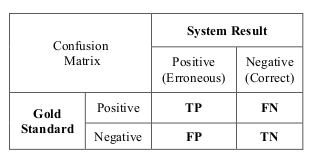

# corrector

## 一、分词

### 1.1 基于词典

#### 1.1.1 最大匹配分词
- 正向最大匹配分词
- 逆向最大匹配分词
- 双向最大匹配分词

### 1.1.2 最短路经算法
- 最短路径分词
- N-最短路径分词

### 1.1.3 基于n-gram的分词算法
master分支 + 1


## 二、 评估指标



- TP(True Positive)：正确识别拼写错误句子（字）数量。
- FP(False Positive)：错误纠正不存在拼写错误句子（字）数量。
- TN(True Negative)：正确识别无拼写错误句子（字）数量。
- FN(Fasle Negative)：存在拼写错误却没被纠正句子（字）数量。

误报率
```
False Positive Rate(FPR) = FP / (FP + TN)
```
准确率
```
Accuracy = (TP + TN) / (TP + FP + TN + FN)
```
准确率
```
Precision = TP / (TP + FN)
```
召回率
```
Recall = TP / (TP + FP)
```
F1
```
F1=2 * Precision * Recall / (Precision + Recall)
```

​中文系统纠错评估指标：
- 精确度
- 召回率
- F1

从任务划分上来看，可将中文系统纠错分为:
- 检错
- 纠错

从评估粒度角度上看，将中文系统纠错评估为
- 句子级别：在句子级别的评估中，若一个句子中的所有错误均被检测出来时，我们才认为其检测正确。
- 词级别：存在问题。
## 三、数据集
SIGHAN（A Special Interest Group of the Association for Computational Linguistics）为客观评估⽂
本纠错能⼒提供数据集作做基准测试（the SIGHAN 2013, SIGHAN 2014, SIGHAN 2015），数据集已放在data目录下。

训练集生成方法：
- ASR
- OCR
- 基于混淆集合

## 四、语言模型
### 统计学语言模型
### kenlm方法
#### ppl
```
    def perplexity(self, sentence):
        """
        Compute perplexity of a sentence.
        @param sentence One full sentence to score.  Do not include <s> or </s>.
        """
        words = len(as_str(sentence).split()) + 1 # For </s>
        return 10.0**(-self.score(sentence) / words)
    
```
#### score
```
    def score(self, sentence, bos = True, eos = True):
        """
        Return the log10 probability of a string.  By default, the string is
        treated as a sentence.  
          return log10 p(sentence </s> | <s>)

        If you do not want to condition on the beginning of sentence, pass
          bos = False
        Never include <s> as part of the string.  That would be predicting the
        beginning of sentence.  Language models are only supposed to condition
        on it as context.

        Similarly, the end of sentence token </s> can be omitted with
          eos = False
        Since language models explicitly predict </s>, it can be part of the
        string.

        Examples:

        #Good: returns log10 p(this is a sentence . </s> | <s>)
        model.score("this is a sentence .")
        #Good: same as the above but more explicit
        model.score("this is a sentence .", bos = True, eos = True)

        #Bad: never include <s>
        model.score("<s> this is a sentence")
        #Bad: never include <s>, even if bos = False.
        model.score("<s> this is a sentence", bos = False)

        #Good: returns log10 p(a fragment)
        model.score("a fragment", bos = False, eos = False)

        #Good: returns log10 p(a fragment </s>)
        model.score("a fragment", bos = False, eos = True)

        #Ok, but bad practice: returns log10 p(a fragment </s>)
        #Unlike <s>, the end of sentence token </s> can appear explicitly.
        model.score("a fragment </s>", bos = False, eos = False)
        """
        if bos and eos:
            return _kenlm.ScoreSentence(self.model, as_str(sentence))
        cdef list words = as_str(sentence).split()
        cdef _kenlm.State state
        if bos:
            self.model.BeginSentenceWrite(&state)
        else:
            self.model.NullContextWrite(&state)
        cdef _kenlm.State out_state
        cdef float total = 0
        for word in words:
            total += self.model.BaseScore(&state, self.vocab.Index(word), &out_state)
            state = out_state
        if eos:
            total += self.model.BaseScore(&state, self.vocab.EndSentence(), &out_state)
        return total
```

#### 训练得到模型
```
\data\
ngram 1=37
ngram 2=47
ngram 3=11
ngram 4=6
ngram 5=4

\1-grams:
-1.383514	,	-0.30103
-1.139057	.	-0.845098
-1.029493	</s>
-99	<s>	-0.4149733
-1.995635	<unk>	-20
-1.285941	a	-0.69897
-1.687872	also	-0.30103
-1.687872	beyond	-0.30103
-1.687872	biarritz	-0.30103
-1.687872	call	-0.30103
-1.687872	concerns	-0.30103
-1.687872	consider	-0.30103
-1.687872	considering	-0.30103
-1.687872	for	-0.30103
-1.509559	higher	-0.30103
-1.687872	however	-0.30103
-1.687872	i	-0.30103
-1.687872	immediate	-0.30103
-1.687872	in	-0.30103
-1.687872	is	-0.30103
-1.285941	little	-0.69897
-1.383514	loin	-0.30103
-1.687872	look	-0.30103
-1.285941	looking	-0.4771212
-1.206319	more	-0.544068
-1.509559	on	-0.4771212
-1.509559	screening	-0.4771212
-1.687872	small	-0.30103
-1.687872	the	-0.30103
-1.687872	to	-0.30103
-1.687872	watch	-0.30103
-1.687872	watching	-0.30103
-1.687872	what	-0.30103
-1.687872	would	-0.30103
-3.141592	foo
-2.718281	bar	3.0
-6.535897	baz	-0.0

\2-grams:
-0.6925742	, .
-0.7522095	, however
-0.7522095	, is
-0.0602359	. </s>
-0.4846522	<s> looking	-0.4771214
-1.051485	<s> screening
-1.07153	<s> the
-1.07153	<s> watching
-1.07153	<s> what
-0.09132547	a little	-0.69897
-0.2922095	also call
-0.2922095	beyond immediate
-0.2705918	biarritz .
-0.2922095	call for
-0.2922095	concerns in
-0.2922095	consider watch
-0.2922095	considering consider
-0.2834328	for ,
-0.5511513	higher more
-0.5845945	higher small
-0.2834328	however ,
-0.2922095	i would
-0.2922095	immediate concerns
-0.2922095	in biarritz
-0.2922095	is to
-0.09021038	little more	-0.1998621
-0.7273645	loin ,
-0.6925742	loin .
-0.6708385	loin </s>
-0.2922095	look beyond
-0.4638903	looking higher
-0.4638903	looking on	-0.4771212
-0.5136299	more .	-0.4771212
-0.3561665	more loin
-0.1649931	on a	-0.4771213
-0.1649931	screening a	-0.4771213
-0.2705918	small .
-0.287799	the screening
-0.2922095	to look
-0.2622373	watch </s>
-0.2922095	watching considering
-0.2922095	what i
-0.2922095	would also
-2	also would	-6
-15	<unk> <unk>	-2
-4	<unk> however	-1
-6	foo bar

\3-grams:
-0.01916512	more . </s>
-0.0283603	on a little	-0.4771212
-0.0283603	screening a little	-0.4771212
-0.01660496	a little more	-0.09409451
-0.3488368	<s> looking higher
-0.3488368	<s> looking on	-0.4771212
-0.1892331	little more loin
-0.04835128	looking on a	-0.4771212
-3	also would consider	-7
-6	<unk> however <unk>	-12
-7	to look a

\4-grams:
-0.009249173	looking on a little	-0.4771212
-0.005464747	on a little more	-0.4771212
-0.005464747	screening a little more
-0.1453306	a little more loin
-0.01552657	<s> looking on a	-0.4771212
-4	also would consider higher	-8

\5-grams:
-0.003061223	<s> looking on a little
-0.001813953	looking on a little more
-0.0432557	on a little more loin
-5	also would consider higher looking

\end\
```
